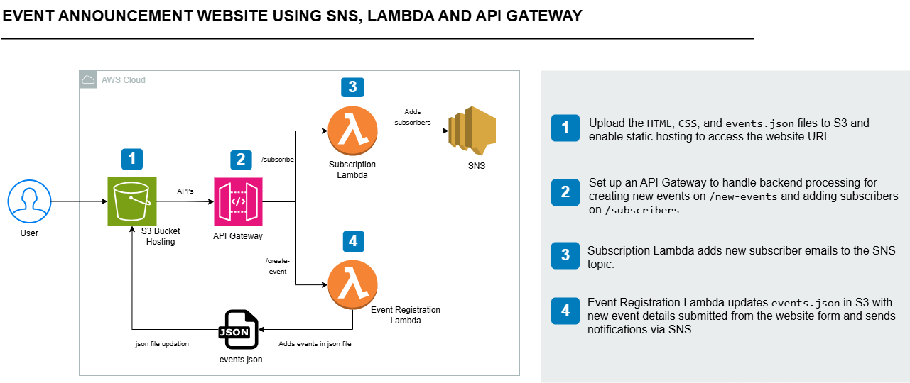

# 🚀 AWS Event Announcement System

## 📖 Overview
A **serverless event announcement platform** built entirely on **AWS**, designed to deliver real-time event notifications via email.  
This project demonstrates end-to-end cloud integration — from static web hosting to event-driven backend processing — using AWS core services.

---

## ✨ Key Features
- ✉️ **Email Subscriptions:** Users can subscribe to receive event notifications.  
- 📅 **Event Management:** View upcoming events and add new ones through a web form.  
- 🌐 **Serverless Hosting:** Static website hosted on **Amazon S3**.  
- ⚡ **Automated Notifications:** New event submissions trigger email alerts via **Amazon SNS**.  

---

## 🧩 Architecture Overview
1. **Frontend (S3 Static Hosting)**  
   - HTML, CSS, and `events.json` uploaded to **Amazon S3** for public access.

2. **API Layer (Amazon API Gateway)**  
   - Exposes endpoints for:
     - `/create-event` → Handles event creation requests.  
     - `/subscribe` → Adds new email subscribers.

3. **Backend (AWS Lambda Functions)**  
   - **Subscription Lambda:** Adds subscriber emails to an SNS topic.  
   - **Event Registration Lambda:** Updates `events.json` in S3 with new event details and triggers SNS notifications.

4. **Notifications (Amazon SNS)**  
   - Publishes event updates to all subscribed users via email.

5. **Security (AWS IAM)**  
   - Implements least-privilege **IAM roles and policies** to control access between services.

---

## 🛠 AWS Services Used
| Service | Purpose |
|----------|----------|
| **Amazon S3** | Host frontend and store `events.json` |
| **Amazon SNS** | Manage subscriptions and send event notifications |
| **AWS Lambda** | Handle backend logic for events and subscriptions |
| **Amazon API Gateway** | Expose secure REST endpoints for frontend communication |
| **AWS IAM** | Control access permissions between AWS services |

---

## 🧱 Architecture Diagram

---

## 👩‍💻 Steps to Deploy
1. **Set up S3 bucket** and enable static website hosting.  
2. **Upload frontend files** (`index.html`, `style.css`, `events.json`).  
3. **Create SNS topic** for event notifications.  
4. **Deploy Lambda functions** for `/create-event` and `/subscribe`.  
5. **Configure API Gateway** endpoints and integrate with Lambda.  
6. **Set IAM roles & policies** for permissions.  
7. **Test the workflow**:
   - Subscribe with an email.  
   - Add a new event.  
   - Receive automated notification.

---

## 💡 Future Enhancements
- Add **DynamoDB** for persistent event storage.  
- Integrate **Amazon Cognito** for secure user authentication.  
- Implement **CI/CD pipeline** with AWS CodePipeline.  
- Add **frontend framework** (React/Vue) for a richer UI.  

---

## 🧠 Key Learnings
- Designing **event-driven serverless architectures**.  
- Using **SNS + Lambda** for automation workflows.  
- Managing secure, scalable APIs with **API Gateway**.  
- Applying **IAM best practices** for resource access.

---
